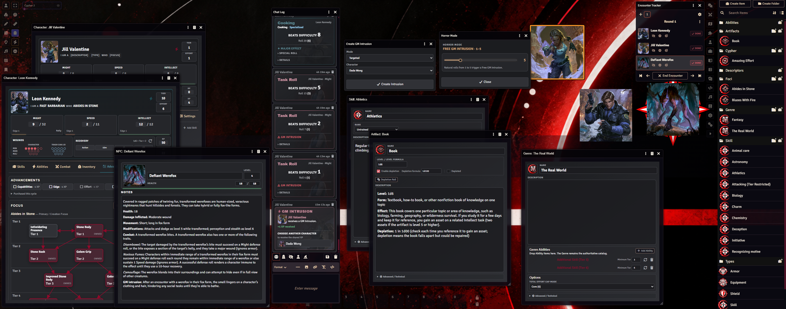

# Cypher V2 for Foundry VTT

> [!IMPORTANT]
> ## AI-ASSISTED PROJECT
> **This system was developed extensively with AI assistance, including ChatGPT and Codex.**
>
> If you do not want to use software made with AI assistance, **do not use this system.**

> [!WARNING]
> ## BETA — NO COMPENDIUMS YET
> **Cypher V2 is currently a BETA release.** Expect bugs, rough edges and changes while it is tested by real groups.
>
> **No ready-to-use Compendiums are bundled yet.** They are currently being written and will be added progressively.

**Cypher V2** (`cypherv2`) is an unofficial Foundry VTT v14 game system for the new edition of Cypher, built around Foundry Application V2 with a modern, compact interface and a rules engine designed to guide play without over-enforcing it.



## Features

- **Foundry VTT v14** native system using Application V2 sheets.
- Modern dark Cypher interface with character accent colors and accessibility-conscious presentation.
- Character, NPC and Item sheets for Abilities, Skills, Weapons, Armor, Shields, Equipment, Cyphers, Artifacts, Descriptors, Types, Foci, Genres and Species.
- **Might, Speed and Intellect Pools**, Edge, Effort and derived package contributions.
- **Wound system** with Minor, Moderate and Major Wounds, including Shield Wounds.
- Recovery, Rest, Rally and Non-Rest Recovery workflows.
- Skills with quick rolls, configured rolls and mastery levels.
- Shared Roll Dialog and detailed Roll Cards with Effort, modifiers, costs, natural results and attack damage breakdowns.
- Hidden/unknown difficulty support for GM-facing NPC difficulties.
- Weapons, Armor and Shields with familiarity, ammo and optional depletion rolls.
- Dodge, Block and Block With Shield defense workflows.
- Manual, player-driven **Combat Tracker** with drag-and-drop ordering and `DONE` turns instead of automated initiative rolls.
- GM Intrusions, Free GM Intrusions and Player Intrusions.
- **Horror Mode** with a GM-controlled Intrusion Range from 1 to 20.
- Descriptor, Type and Species package automation with provenance-aware grants and interactive choice dialogs.
- Fixed and choice-based Pool bonuses, Skill grants, Ability grants and Edge choices.
- Multiple Descriptors and multiple Foci per Character.
- Focus progression graph, acquisition workflow and GM Focus Tree Editor.
- Character Advancement with Tier progression and Resource Points.
- Genre Ability catalogues and configurable Core/Unlimited total Effort cap.
- Native ProseMirror rich-text editing on Application V2 sheets.
- Custom Cypher default Actor/Item artwork, pause screen, turn marker and no-Scene lobby artwork.
- English interface and localization catalogue.

## Beta status

This repository is being opened publicly so other GMs can test the system in real games and find the things its author and automated test suite did not.

The current priority is **stability, feedback and Compendium authoring**, not adding large new feature sets. Existing data structures and UI may still evolve during the beta.

Bug reports and useful feedback are welcome through GitHub Issues. You can also find **SokK** on the **Cypher Unlimited Discord**.

## Design philosophy

Cypher V2 generally follows a **“Guide, Don’t Enforce”** approach. The system automates repetitive bookkeeping and exposes useful rules information, but deliberately leaves room for the GM and players to make decisions at the table instead of trying to encode every possible Cypher ruling.

Some important principles:

- Source data is kept separate from derived data.
- Characters may own multiple Descriptors and multiple Foci.
- Package bonuses are derived from attached package Items and retain provenance for safe removal/replacement.
- NPCs use Health; Characters use Wounds.
- Players roll defenses; NPC difficulty can remain hidden from public Chat data.
- Hidden difficulties provide interface confidentiality, not hostile-client security.
- The distributed product UI is English-only for now.

## Development

Requirements:

- Node.js 20.19 or later.
- pnpm 9 or later.
- Foundry VTT 14.360 for runtime testing.

Install and verify:

```bash
pnpm install
pnpm check
```

Useful commands:

```bash
pnpm dev
pnpm typecheck
pnpm test
pnpm build
```

`pnpm dev` rebuilds the bundle when TypeScript or SCSS files change. Foundry must be restarted or refreshed to load a newly built JavaScript bundle.

For architecture notes, see:

- [Architecture decisions](docs/architecture/DECISIONS.md)
- [Roll Engine](docs/architecture/ROLL-ENGINE.md)
- [Combat Core](docs/architecture/COMBAT-CORE.md)
- [Focus Tree](docs/architecture/FOCUS-TREE.md)

## Manual development installation

Clone or copy the repository as `cypherv2` directly under the Foundry data directory:

```text
Data/systems/cypherv2
```

Then run the build if required and restart Foundry. The repository already tracks the generated `dist` bundle used by the system.

A normal beta installation/update manifest will be provided through GitHub releases as the release packaging is finalized.

## Content and licensing

This is an **unofficial fan-made system** and is not an official Monte Cook Games or Foundry Virtual Tabletop product.

The software is MIT licensed. Open game content and other third-party material must follow the provenance and licensing requirements documented in the repository.

See:

- [LICENSE.md](LICENSE.md)
- [Content Sources](legal/CONTENT-SOURCES.md)
- [Third-Party Notices](legal/THIRD-PARTY-NOTICES.md)
- [Asset Licenses](legal/ASSET-LICENSES.md)
